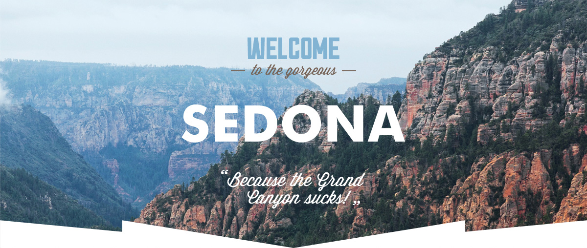

# Личный проект «Мишка» [![Build status][travis-image]][travis-url] [![Dependency status][dependency-image]][dependency-url]

* Студент: [Никита Швец](https://up.htmlacademy.ru/adaptive/15/user/595607).
* Наставник: [Николай Маркелов](https://htmlacademy.ru/profile/nikolamarkelov).

---

**Обратите внимание, что папка с вашими исходными файлами — `source/`.**

Полезный файл:

- [Contributing.md](Contributing.md) — руководство по внесению изменений.

_Не удаляйте и не обращайте внимание на файлы:_ 
_`.editorconfig`, `.gitattributes`, `.gitignore`, `.stylelintrc`, `.travis.yml`, `package-lock.json`, `package.json`._

---

### Памятка

#### 1. Проект "Sedona"

#### 2. Вёрстка

1. HTML5, CSS3
1. Фикс вёрстка
2. Вёрстка Pixel-Perfect
3. Вёрстка из PSD-макета + styleguide
4. Семантическаяя вёрстка.
5. Кроссбраузерность: IE11+, Edge, Chrome, Firefox, Opera, Safari.

#### 3. Клонируйте репозиторий на свой компьютер

#### 4. Начинайте обучение!

