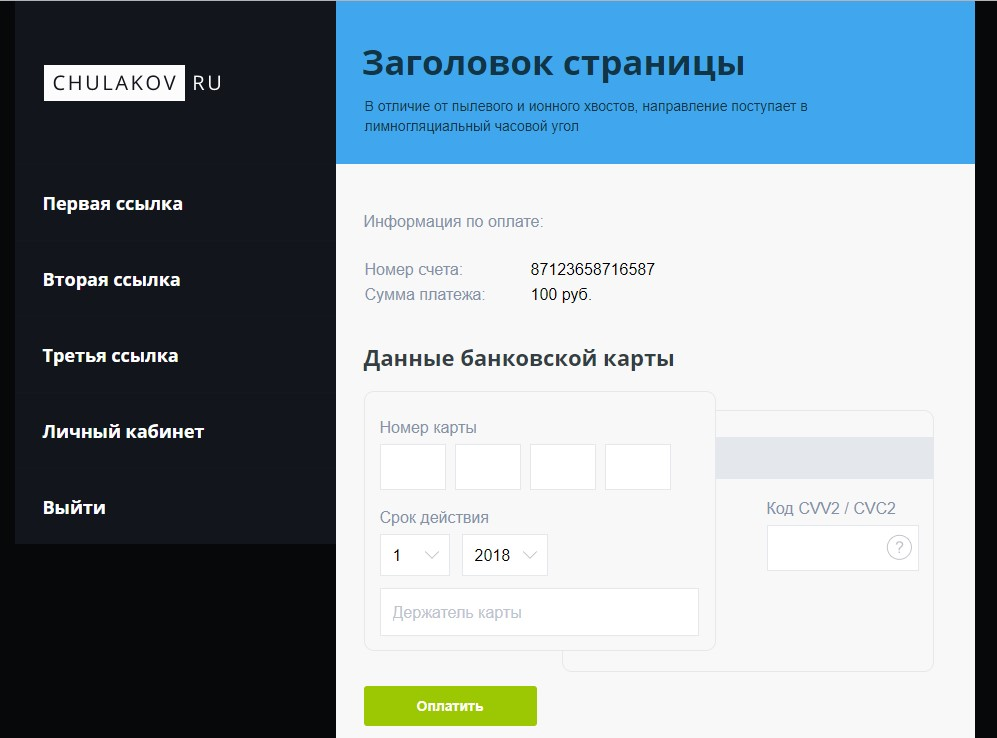

* Тестовое задание

#### 1. [Тестовое задание](https://niksvhvets.github.io/site-10/)

Сборка проекта 

<b>npm run build</b> -> https://niksvhvets.github.io/site-9/

#### 2. Вёрстка

1. [Вёрстка главной страницы сайта](https://niksvhvets.github.io/site-10/)

bem-validate index.html - <b>OK</b> 
npm test - <b>OK</b> 
https://validator.w3.org/ - <b>OK</b>

 1. HTML, CSS, JS
 2. Адаптивная, семантическая верстка
 3. Препроцессор LESS
 4. Сборщик Gulp
 5. Кроссбраузерная верстка : IE 10+, Safari, Opera, Firefox, Edge, Chrome

#### 3. Общие технические требования

* [требования к заданию](https://docs.google.com/document/d/12OjWpw0lDEjlAj7zDgK5La3fS-wyvjSEyQSM9m6zR-I/edit).