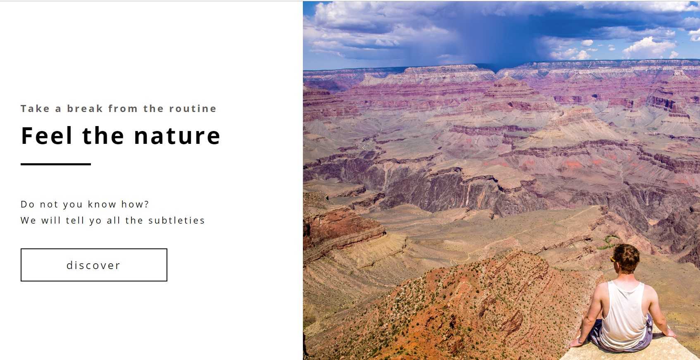

#### 1. Проект "Blueasy"

#### 2. Вёрстка

1. [Вёрстка главной страницы сайта](https://niksvhvets.github.io/site-5/)

#### 3. Общие технические требования

1. HTML5, CSS3.
2. responsive вёрстка.
3. Семантическая вёрстка.
4. Сетка: flexbox.
5. Оптимизация графики.
6. Кроссбраузерность: Chrome, Firefox, Opera, Safari, Edge и IE11.
7. Типографика: частично определена в макете (прочее — на усмотрение разработчика).
