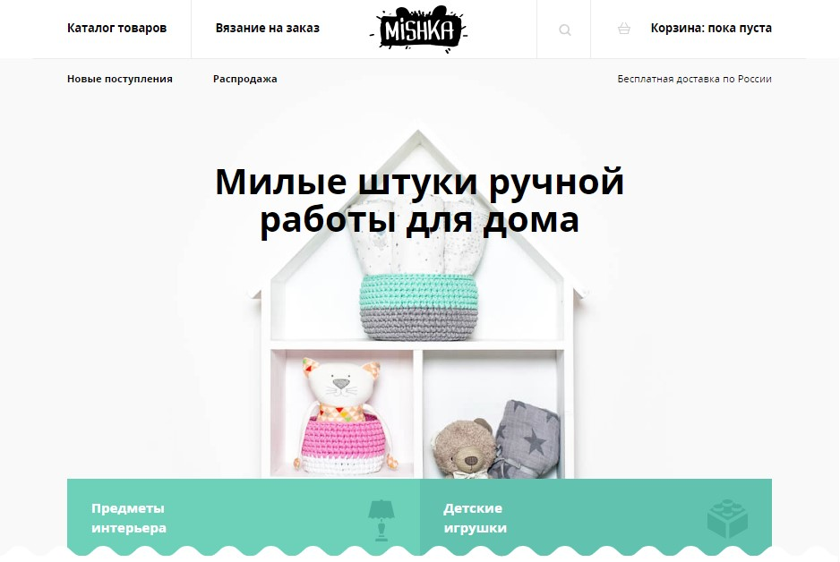

* Проект выполен и защищён в рамках курса: [HTML и CSS, уровень 2](https://htmlacademy.ru/intensive/adaptive).

#### 1. Проект "Mishka"

#### 2. Вёрстка

  * Вёрстка под <b>desktop</b>, <b>tablet</b>, <b>mobile</b> !

1. [Вёрстка главной страницы сайта](https://niksvhvets.github.io/site-6/)
2. [Вёрстка раздела "каталог товаров"](https://niksvhvets.github.io/site-6/catalog.html)
3. [Вёрстка раздела "Вязание на заказ"](https://niksvhvets.github.io/site-6/form.html)

#### 3. Общие технические требования

1. HTML5, CSS3
2. Фикс вёрстка
3. Вёрстка Pixel-Perfect
4. Вёрстка из PSD-макета + styleguide5
5. Семантическая вёрстка.
6. Сетка: определена в макете.
7. Адаптивность сетки: мобильная, планшетная и десктопная версии («фикс» или «резина»).
8. Адаптивность графики: ретинизация, векторные изображения.
9. Используемая методология: БЭМ.
10. Используемый препроцессор: Less или Sass.
11. Используемый инструмент автоматизации: Gulp.
12. Используемые фреймворки: нет.
13. Кроссбраузерность: Chrome, Firefox, Opera, Safari, Edge и IE11.
14. Типографика: частично определена в макете (прочее — на усмотрение разработчика).
15. Используемый шрифт: Open Sans.

#### 4. Критерии проверки проекта.

  * <b>Базовые критерии:</b>

  <b>Разметка</b>

  Б1. Выполнена HTML-разметка всех страниц проекта и всех элементов на этих страницах. 
  Б2. Грубые ошибки в разметке отсутствуют. 
  Б3. Документ проходит проверку на валидность https://validator.w3.org/nu/. 
  Б4. В разметке отсутствует дублирование кода для одного и того же элемента, с помощью которых элемент отображается в разных местах страницы на разных версиях: мобильной, десктопной, планшетной. Этот критерий не касается элементов, которые скрываются или показываются в разных версиях. 
  Б5. Отсутствуют типовые ошибки в разметке по методологии. 
  Б32. Названия полей форм привязаны к своим полям с помощью <label>. 
  
  <b>Стилизация</b>

  Б6. Раскладка блоков на странице сделана с помощью флексбоксов. 
  Б7. В CSS отсутствует !important. 
  Б8. Подключены правильные шрифты, их размеры, цвет и толщина равны соответствующим параметрам в макетах и техническом задании. 
  Б9. Нестандартные шрифты подключены локально. Формат шрифтов должен быть woff и woff2. 
  Б10. Указаны альтернативные варианты шрифта и тип семейства в конце перечисления font-family. 
  Б11. При наполнении контентом (как в макете) элементы каждой версии страницы (мобильной, планшетной и десктопной) соответствуют макету. 
  
  <b>CSS-препроцессор</b>

  Б12. Использован CSS-препроцессор. 
  Б13. Код стилей должен быть разбит на несколько частей. 
  
  <b>Адаптивность</b>

  Б14. Выполнена вёрстка трёх состояний каждой страницы: мобильной, планшетной и десктопной. 
  Б15. В разметке есть правильный вьюпорт тег. 
  Б16. Для микросеток использованы флексбоксы. 
  Б17. Выполнена ретинизация растровой графики. 
  Б19. Логотип должен адаптироваться. 
  Б20. Выполнено кадрирование контентных изображений. 
  
  <b>Графика</b>

  Б18. Использована векторная графика. 
  
  <b>Оптимизация</b>

  Б21. «Нежная» ретинизация. 
  
  <b>Сборка проекта</b>

  Б22. Процесс сборки личного проекта настроен с помощью Gulp. 
  Б23. Все зависимости проекта должны быть указаны в файле package.json. Команда npm i должна установить всё необходимое для того, чтобы сборка проекта работала. 
  Б24. Сборка проекта должна запускаться командой npm run build. 
  Б25. В результате сборки должна получаться папка build со всеми необходимыми файлами. 
  Б26. Папка build со всем её содержимым не должна попадать в Гитхаб. 
  
  <b>Разное</b>

  Б27. Вёрстка идентично отображается в последних версиях браузеров Chrome, Opera, Firefox, Safari, Edge, а также в Internet Explorer 11. 
  Б28. Единообразное написание и форматирование кода в HTML, файлах CSS-препроцессора и JavaScript (включая файлы автоматизации). 
  Б29. Отсутствует транслит в названиях классов, атрибутах, переменных CSS-препроцессора, названиях примесей и так далее. 
  Б30. Мобильное меню должно быть работоспособным при отключённом JavaScript. 
  Б31. Проект соответствует техническому заданию. 

  * <b>Дополнительные критерии:</b>

  
  <b>Разметка</b>

  Д1. У всех векторных изображений размер прописан в теге , у встроенных SVG-изображений размер прописан в теге <svg>. 
  Д2. Использовано минимально возможное количество HTML-элементов (нет лишних элементов). 
  
  <b>Стилизация</b>

  Д4. Для стилизации не использованы #id. 
  Д6. Для блока, у которого есть фоновое изображение, прописан фоновый цвет, который соответствует преобладающему цвету изображения (пока изображение не загружено, страница выглядит похоже на макет). 
  Д7. Все состояния элементов (смотрите styleguide.psd) прописаны в стилевом файле. 
  Д16. Нет глобальных стилей тегов. 
  
  <b>CSS-препроцессор</b>

  Д8. Запрещено использовать цветовые функции для изменения цветовых значений в коде. 
  Д9. Примеси не используются для генерации правил с вендорными префиксами. 
  Д10. Вложенность селекторов не больше двух уровней. 
  Д11. & только для псевдоэлементов, псевдоклассов и модификаторов 
  Д12. Не используются расширения (extend). 
  
  <b>Тестирование</b>

  Д13. Вёрстка проходит тест на переполнение контентом. 
  Д14. Критическая функциональность сайта работоспособна без JavaScript (использовано прогрессивное улучшение). 
  
  <b>Доступность</b>

  Д17. У интерактивных элементов при нажатии или фокусе с клавиатуры есть активное состояние. 
  Д18. Все интерактивные элементы имеют текстовое описание. 
  
  <b>Форматирование и внешний вид</b>

  Д19. Код соответствует правилам в EditorConfig 
  Д20. Код соответствует правилам в Stylelint. 
  
  <b>Оптимизация</b>

  Д21. Использованы изображения в формате WebP. 
  Д22. Использован векторный спрайт. 
  Д23. Произведена оптимизация загрузки шрифтов. 
  
  <b>Разное</b>

  Д15. При взаимодействии с элементами (наведение, нажатие) ни сам элемент, ни окружающие его блоки не меняют своего положения (если иное не прописано в техническом задании или styleguide.psd). 
