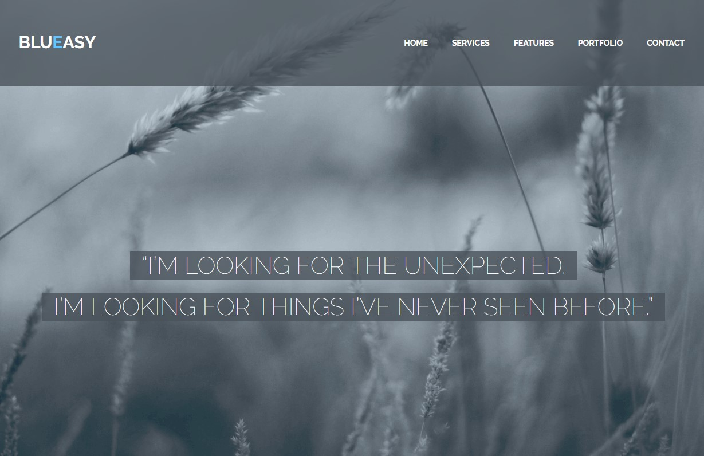

#### 1. Проект "Blueasy"

#### 2. Вёрстка

1. [Вёрстка главной страницы сайта](https://niksvhvets.github.io/site-7/)

#### 3. Общие технические требования

1. HTML5, CSS3.
2. Фикс вёрстка.
3. Вёрстка из PSD-макета.
4. Семантическая вёрстка.
5. Сетка: flexbox.
6. Используемая методология: БЭМ.
7. Используемый препроцессор: Less.
8. Используемый инструмент автоматизации: Gulp.
9. Используемые фреймворки: нет.
10. Оптимизация графики.
11. Кроссбраузерность: Chrome, Firefox, Opera, Safari, Edge и IE11.
12. Типографика: частично определена в макете (прочее — на усмотрение разработчика).
13. Используемый шрифт: Raleway.
